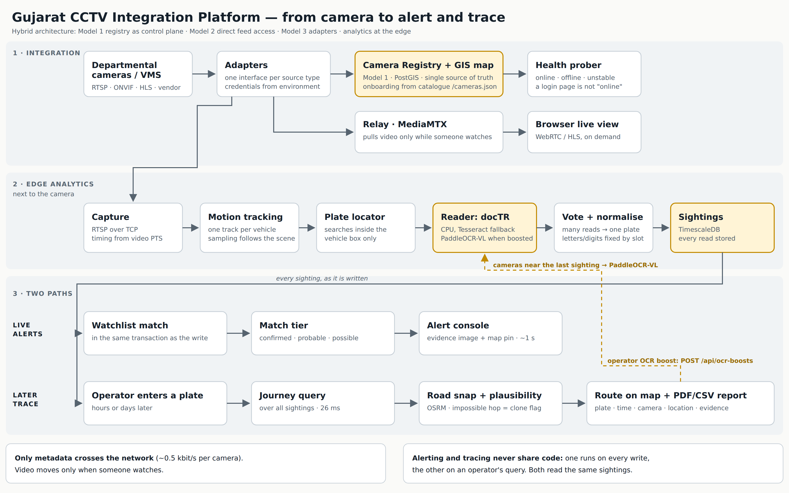
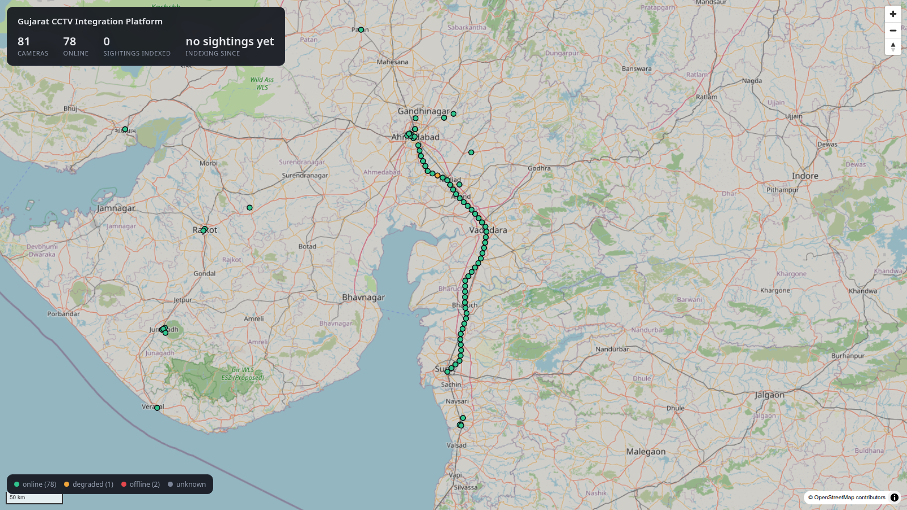
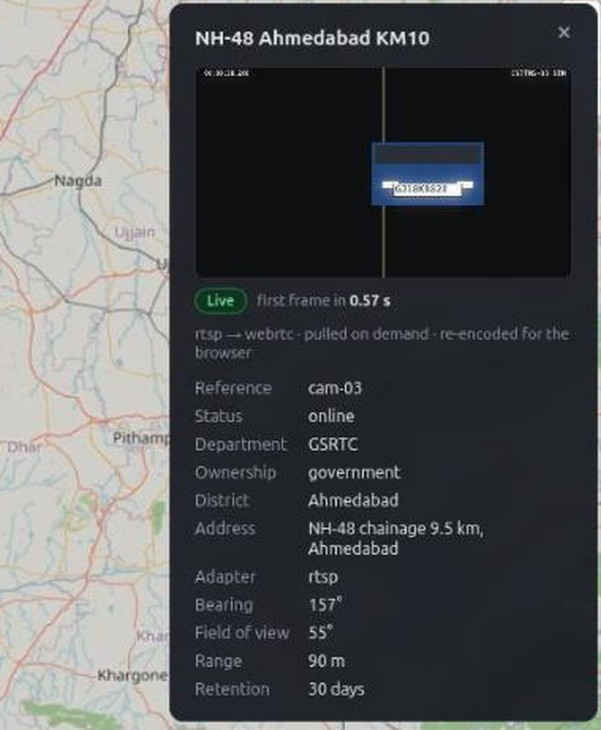
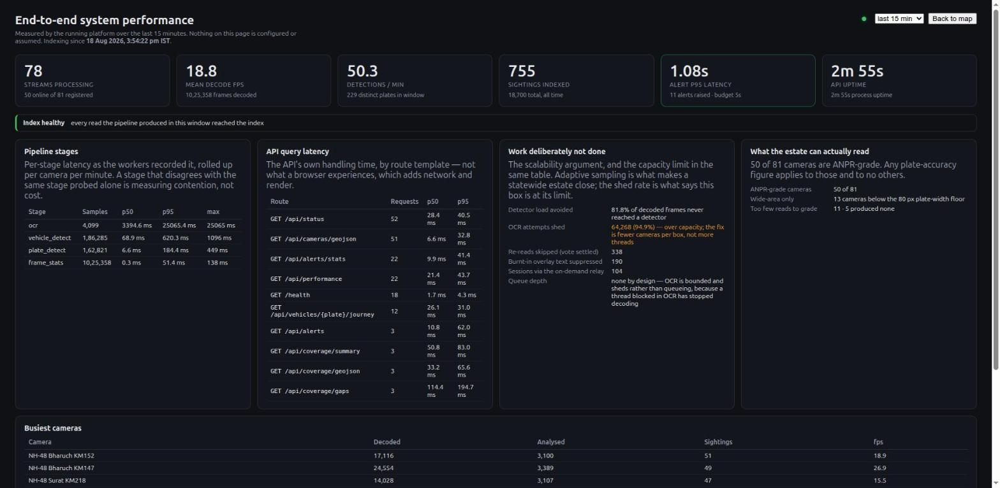

# Solution Presentation — slide content

> **Deliverable 1.** Eight required elements; the traceability column shows where
> each is answered. This file is the authoritative content — the slides are
> built from it, so a change here is a change to the deck.
>
> **Rules this deck follows:** no invented percentages, no number that is not
> either measured on the 81-camera estate or shown as arithmetic from one, and
> no capability presented as built when it is designed. An SCRB evaluator knows
> the real operational numbers better than we do; the credibility of the
> measured figures depends on not sitting beside invented ones.

| Slide | Required element |
|---|---|
| 1 | Title |
| 2 | *(framing)* |
| 3–4 | **1** — Proposed model with justification |
| 5–6 | **2** — Overview, objectives, key innovations |
| 7–9 | **3** — Architecture, end-to-end workflow, workflow diagram |
| 10–12 | **4** — AI analytics approach, and the measured reader ladder |
| 13–14 | **5** — Watchlist correlation and real-time alerts |
| 15 | **6** — Key technologies, frameworks, tools |
| 16–17 | **7** — Scalability, interoperability, security, deployment |
| 18 | **8** — Expected operational benefits and impact |
| 19 | *(evidence)* The working platform |
| 20–21 | *(evidence)* Measured performance, and the page that reports it |
| 22–23 | *(evaluation)* The seven common areas, and the bonus considerations |
| 24 | *(credibility)* What we do not claim |

The evaluation mapping on slides 22 and 23 follows the framework published at
<https://sentinel.gujarat.gov.in/problems>: seven common evaluation areas, then
six bonus considerations.

---

## Slide 1 — Title

**Statewide CCTV Integration & Vehicle Intelligence Platform**
Gujarat Police Hackathon 2026

*Edge-first federated architecture · Hybrid Model 1 + 2 + 3*

> Working platform. 80 cameras onboarded, 869 tests, every figure in this deck
> measured on the running system.

---

## Slide 2 — The constraint that shapes the entire design

> *"During the evaluation, participants will be provided with a designated
> vehicle registration number."*

By the time that number is handed over, **the vehicle has already driven past the
cameras.** There is no opportunity to go and look for it.

The only thing that can answer is **an index of every plate already read**.

**Consequence:** we persist every ANPR read unconditionally — not just watchlist
matches. This moves the system's cost from the query path to the write path, and
every sizing decision in this deck follows from it.

> *Speaker note: this is the slide that separates teams who understood the
> evaluation from teams who built a watchlist alerter.*

---

## Slide 3 — Element 1: Proposed model

> **Hybrid Architecture — Model 1 registry as control plane, Model 2 as the
> demonstrated feed-access path, Model 3 as the federation spine, delivering
> Model 4's analytics outcomes through distributed edge inference rather than
> centralised video ingest.**

| Model | Role in the hybrid | Demonstrated by |
|---|---|---|
| **M1 — Registry & GIS** *(mandatory)* | **The control plane, not a side deliverable.** Adapter choice, RBAC scope, health, coverage and route plausibility all resolve through it | 80 cameras onboarded (50 simulated, 30 government); GIS map; gap analysis |
| **M2 — Unified viewing & metadata** | The feed-access and operator layer. Direct RTSP/ONVIF is genuinely right for cameras with no VMS in front of them — which is most of them | Live view, searchable sightings, alert console |
| **M3 — Federation & adapters** | The spine that makes M2 survive scale. A new vendor is a plugin, not a redesign | One interface; adding a source type changes no other file |
| **M4 — Analytics outcomes** | Its **goals** adopted in full. Its **centralised ingest** rejected on cost | Journey reconstruction, watchlist correlation, real-time alerts |

**The organising idea:** move the analytics to the edge, move only metadata to
the centre, move video only on demand.

---

## Slide 4 — Element 1: Why we rejected Model 4

Run the arithmetic at the brief's own stated scale of 80,000 cameras:

| | Central VMS (Model 4) | This platform |
|---|---|---|
| Sustained backhaul | **240 Gbit/s** | **~40 Mbit/s** *(measured 0.5 kbit/s per camera)* |
| Central storage, 15-day retention | **~26 PB** | **~5 GB/day** compressed rows |
| Existing departmental VMS, storage, AMC | Replaced | **Preserved and reused** |
| Behaviour on WAN outage | Blind | Edge keeps detecting *(design)* |

**Two reasons this is a rejection, not a preference:**

1. **It contradicts the stated Core Goal** — *"cost-effective"* and *"uses
   existing infrastructure to the maximum practical extent."* Model 4 discards
   26 departments' investments and rebuilds them centrally.
2. **It contradicts the bonus criteria**, which explicitly reward *"strong
   edge-processing, bandwidth-optimisation, or low-connectivity operation."*

> A rejected option costed out is evidence of engineering judgement. We adopt
> every functional outcome Model 4 lists; we decline one implementation choice —
> hauling raw video to the centre.

---

## Slide 5 — Element 2: Solution overview and objectives

**Three capabilities, graded separately, all built:**

| | Objective | State |
|---|---|---|
| **Onboard** | Any camera, any brand, any protocol — without redesign | 80 cameras; **5.1 s** per camera against a 30 s budget |
| **Read** | Continuously read plates from every camera and store **all** of them | **82.4%** exact on ANPR-grade cameras; 104 sightings/min |
| **Trace & alert** | A plate returns a route across the state; a wanted vehicle raises an alert in real time | **26 ms** trace · **1.04 s** detection-to-alert |

**Supporting objectives, also built:** report export (CSV + PDF with evidence
crops), coverage and gap analysis, health monitoring, audit trail, role- and
department-scoped access, live performance evidence in the UI.

---

## Slide 6 — Element 2: Five key innovations

| | Innovation | The measurement behind it |
|---|---|---|
| **1** | **Edge-first metadata architecture** — analytics beside the camera, ~250-byte events northbound | **0.5 kbit/s** per camera against ~3 Mbit/s of video — four orders of magnitude |
| **2** | **Registry as control plane**, not inventory — adapters, RBAC, health, geography and route plausibility all resolve through it | The organisers' grid changed hostname mid-build; it cost **one environment variable** |
| **3** | **Per-track confidence voting + derived confusable-character normalisation** — the confusion table is *generated* from glyph similarity, never typed in | Positional coercion; a hand-written table cannot distinguish a considered omission from an oversight |
| **4** | **Travel-time plausibility scoring** — an impossible hop splits the journey instead of being dropped | **Cloned-plate detection as a by-product** of route reconstruction |
| **5** | **Self-calibrating tamper detection** — each camera judged against its own normal, not a global threshold | False positives **39 → 0** |

> Innovations 3 and 4 exist because of the same principle: **the anomaly is the
> signal.** A system that quietly discards the outlier discards the crime.

---

## Slide 7 — Element 3: High-level architecture

```
┌──────────────────────────────────────────────────────────────────┐
│  L5  PRESENTATION   GIS console · Alert desk · Journey explorer ·│
│                     Registry portal · Performance evidence        │
├──────────────────────────────────────────────────────────────────┤
│  L4  INTELLIGENCE   Watchlist matcher · Journey reconstruction ·  │
│                     Cross-camera re-ID · Alert writer · Reports   │
├──────────────────────────────────────────────────────────────────┤
│  L3  PLATFORM CORE  Event store · CAMERA REGISTRY & GIS ★ ·       │
│                     RBAC · Audit · On-demand stream broker        │
├──────────────────────────────────────────────────────────────────┤
│  L2  FEDERATION     Adapter framework · Credential resolution ·   │
│                     Health prober · Protocol normalisation        │
├──────────────────────────────────────────────────────────────────┤
│  L1  EDGE ANALYTICS Decode · Sample · Detect · Track · Locate ·   │
│                     OCR · Vote · Tamper                           │
├──────────────────────────────────────────────────────────────────┤
│  L0  SOURCES        IP cams · Analog+encoder · NVRs · Dept VMS    │
└──────────────────────────────────────────────────────────────────┘
              ★ = mandatory Model 1, positioned as control plane
```

**What crosses the district→state link:** metadata always, video only on demand.

---

## Slide 8 — Element 3: End-to-end workflow

```
 A vehicle passes a camera in Rajkot
   │
   ① registry already knows the camera, its position, its adapter
   │
   ② stream opened — timing from the video's own PTS, never arrival
   │
   ③ vehicle detected and tracked; plate located INSIDE the vehicle box
   │
   ④ OCR on each sampled crop → per-track vote → ONE plate string
   │
   ⑤ sighting written — ALWAYS, every vehicle, ~300 bytes
   │      └── in the SAME TRANSACTION: matched against the watchlist,
   │          alert written if it hits. Both rows commit, or neither
   │
   ⑥ operator sees the alert with its evidence bundle    1.04 s
   │
   ⑦ later — a plate is typed, and its route across the state
      returns as GeoJSON                                  26 ms
```

**Steps ⑤ and ⑦ are the product.** ⑤ is what makes ⑦ possible on evaluation day.

*Two details that are not obvious and are load-bearing:*

- **Plate search is confined to a vehicle box** — every government feed burns a
  timestamp band and site label onto its own picture, at plate size and
  contrast. Whole-frame recognition reads the camera's clock as a registration
  number, on every camera, forever.
- **Timing comes from the video, not from arrival** — a gateway replays its
  buffer on connect, so frames arrive faster than real time. Timed by arrival,
  every reconnect computes an impossible speed and reports a cloned plate.

---

## Slide 9 — Element 3: End-to-end workflow, as a diagram



Three bands, read top to bottom:

1. **Integration** — departmental cameras reach the platform through adapters.
   The registry is the control plane and is onboarded from the catalogue at
   `/cameras.json`, never by counting cameras. The relay pulls video only while
   somebody is watching.
2. **Edge analytics** — capture over RTSP with timing from the video's own PTS,
   motion tracking, plate localisation inside the vehicle box, docTR reading
   with PaddleOCR-VL available on demand, per-track voting, then positional
   normalisation. Every read is stored.
3. **Two paths** — live alerting evaluates every sighting as it is written;
   retrospective trace answers an operator's query hours later. They read the
   same table and share no code, because the evaluation grades both.

**Only metadata crosses the network,** about 0.5 kbit/s per camera. Video moves
only when someone watches.

---

## Slide 10 — Element 4: AI analytics approach

```
decode → sample → detect + track → locate plate → OCR
       → reject overlay text → per-track vote → normalise → persist
```

| Stage | Approach | Why |
|---|---|---|
| **Sampling** | Analysis rate follows scene activity | 80,000 × 15 fps = 1.2 M detections/s does not close. **81.3% of analysis avoided** |
| **Detection & tracking** | Multi-object tracking, stable id per vehicle | Voting needs a track, not a frame |
| **Plate localisation** | Inside the vehicle box only | Removes the burnt-in-overlay error class entirely |
| **Recognition** | docTR on the CPU, confidence retained; **PaddleOCR-VL on GPU for cameras an operator boosts** | Night plates found 35% → 62% (docTR) and 100% (PaddleOCR-VL) on the test clips |
| **Voting** | Whole-string **and** per-character, confidence-weighted | Per-frame emission duplicates records *and* discards many independent opinions |
| **Normalisation** | **Positional** — coerce by plate slot, at write **and** query time | Global `O→0` merges different vehicles onto one key |
| **Persistence** | Unconditional, including format failures | A mis-read wanted vehicle is worse than a noisy record |

**Beyond ANPR:** vehicle class and appearance attributes · **a vehicle id on
every sighting**, joined by plate or by a learned appearance vector
(DINOv2-small), so an unreadable vehicle can still be followed · self-calibrating tamper detection ·
per-camera health analytics · **on-demand OCR boost**: an operator switches the
cameras around a location to the strongest reader for a set time.

---

## Slide 11 — Element 4: What the measurements actually said

**Accuracy is reported per condition. A single headline would average three
different problems.**

| Condition | Exact | Within 2 characters |
|---|---|---|
| Daylight | **86.6%** | 98.1% |
| Glare | 57.1% | 92.9% |
| Night | **58.6%** | 75.9% |
| Overall, ANPR-grade cameras | **82.4%** | **95.1%** |

Measured with Tesseract. docTR, a general CPU OCR model, found **62%** of night plates against Tesseract's **35%** on the same test clips, in 37 ms per crop against ~100 ms. It is the default reader since 14 Sep 2026.

**The finding that surprised us — heavier was not better:**

| | Measured |
|---|---|
| Tesseract on Indian plates | **83% exact** |
| A general hub OCR model, same crops | **1.1% exact** — it misreads the Indian font systematically |
| Single-image GPU inference | **24.4 ms** vs the CPU path's **17.0 ms** |
| docTR, a general OCR model, on the CPU (14 Sep) | night plates found **62%** vs Tesseract's **35%**, at **37 ms** vs ~100 ms per crop |

> **Light models by default, heavy models as a measured per-camera fallback.**
> Cameras the light path demonstrably cannot read escalate on their own
> evidence — one rung at a time, budgeted, rolled back if it does not help.
>
> The largest remaining accuracy gain available is an India-trained recogniser,
> and it is the one that addresses the night figure.

---

## Slide 12 — Element 4: The reader ladder, measured

**Night is where readers separate, and it is the condition that matters.**

Plates found on the 12 generated traffic clips (101 night, 69 day), 14 Sep 2026:

| Reader | Night | Day | Cost per crop |
|---|---|---|---|
| Tesseract | **34.7%** | 84.1% | ~90-110 ms, CPU |
| docTR PARSeq | **62.4%** | 95.7% | 37 ms, 4 CPU threads |
| PaddleOCR-VL | **100%** | 100% | 12.5 s CPU, ~440 ms GPU |

docTR is the default because it fits a CPU edge box. PaddleOCR-VL needs a GPU
and runs only on the cameras an operator boosts.

**Day hides the difference.** Every reader is respectable in daylight, so a
daylight-only benchmark would have justified the cheapest one and left the
estate blind at night, which is when the vehicles we are asked about actually
move.

*In the PPTX this slide renders as a native, editable column chart built from
the same table.*

---

## Slide 13 — Element 5: Watchlist correlation methodology

**Matching happens on the write path, not in a downstream consumer.** The
watchlist is held in process and refreshed on a 2-second timer — at 104
sightings a minute, a per-sighting query puts a network round trip on the
pipeline's hot path.

**A match is not a boolean:**

| Tier | Condition | Operator meaning |
|---|---|---|
| **confirmed** | Exact key **and** confidence ≥ 0.85 | Act on it |
| **probable** | Exact key at lower confidence, **or** edit distance 1 | Verify against the evidence crop |
| **possible** | Edit distance 2 | A lead — corroborate before acting |

**Why tiers, in one line each:**

- **Exact-only misses 12.7% of reads** — 82.4% exact against 95.1% within two
  characters. A system that misses one wanted vehicle in eight is not working.
- **Anything-close floods the operator** until they stop reading alerts, which
  is worse than not alerting.
- **The same string at 0.4 and at 0.95 is different evidence.** Confidence
  splits an exact match, and the tier is how the operator is told which one they
  are looking at.

---

## Slide 14 — Element 5: Real-time alerting

```
sighting ─► tier ─► priority = severity − tier demotion
                 ─► dedup: same plate, same camera, 120 s
                    (×3 for `possible` — a low-tier repeat is far more
                     likely to be a re-read than a second event)
                 ─► alert row, SAME TRANSACTION as the sighting
                 ─► evidence bundle: crop · plate read · confidence ·
                    matched record · case ref · camera · district ·
                    lat/lon · timestamp · measured latency
                 ─► new → acknowledged → actioned │ dismissed
```

| | Budget | **Measured** |
|---|---|---|
| Detection → alert on screen | 5 s | **1.04 s** |

**Two design consequences worth stating:**

- **The alert and the sighting commit together, or neither does.** The time-
  series store cannot enforce that foreign key, so the transaction enforces it
  structurally: an alert can never point at a sighting that does not exist.
- **There is no delete.** `dismissed` and `false_positive` are statuses. An
  alert an operator judged wrong is itself evidence — of the error rate, and of
  the decision taken.

---

## Slide 15 — Element 6: Key technologies, frameworks, tools

| Layer | Choice | Why this one |
|---|---|---|
| Store | **TimescaleDB** (PostgreSQL + PostGIS + hypertables) | Registry, geospatial and time-series in **one** database — removes a distributed-consistency problem we do not need |
| Plate search | **`pg_trgm`** trigram indexing | Sufficient at this scale; a search cluster is the scale path, not the starting point |
| Vectors | **pgvector** | Vehicle appearance search (DINOv2-small, 384 numbers) in the database already present |
| Media | **MediaMTX** | RTSP in, WebRTC/HLS out — the relay the brief already anticipates |
| Events | **Redpanda** | Kafka wire protocol, single binary, no ZooKeeper |
| Routing | **OSRM** + Gujarat OSM extract | Road-network snapping and travel-time plausibility |
| API | **FastAPI** + OpenAPI | Documented, browsable, integration-ready by construction |
| Map | **MapLibre GL** | GPU-rendered. Leaflet's DOM markers do not survive statewide density — and 80,000 points is the claim |
| Recognition | Classical localisation + docTR on the CPU (Tesseract as fallback), with a measured escalation ladder | See slide 11 — the measurement, not the fashion |

**Justified deviations from the suggested stack:** MapLibre over Leaflet,
TimescaleDB + trigram over Elasticsearch, Redpanda over Kafka. Each stated with
its reason in the HLD, because unexplained deviation is penalised and justified
deviation is not.

---

## Slide 16 — Element 7: Scalability at 80,000 cameras

**Measured on a 20-core / 125 GB host:**

> **50–57 cameras per box.** At 57 cameras, recognition p50 **624 ms** with a
> healthy 6.1% shed. At 76 cameras the same box shed **94.7%** and p50 rose to
> 3.4 s.

| | Arithmetic | Result |
|---|---|---|
| Nodes for 80,000 cameras | 80,000 ÷ 50 | **1,600** |
| Per district | 1,600 ÷ 33 | **~48** |
| Sightings/day | 80,000 × 1.5/min × 1,440 | **~173 million** |
| Compressed rows/day | 173 M × 300 B ÷ 10 | **~5 GB/day** |
| Metadata backhaul | 80,000 × 0.5 kbit/s | **~40 Mbit/s** |

> **1,600 nodes is arithmetic, not a distributed-systems project.** Workers claim
> a shard with a database advisory lock — no orchestrator, no leader election, no
> per-replica configuration — and a crashed worker returns its shard the instant
> its connection drops.

**We also say what would move the figure:** cross-camera GPU batching is
plausibly 3–5× per node, taking 1,600 toward ~400. It is an architecture change,
not a flag, and it is not claimed.

---

## Slide 17 — Element 7: Interoperability, security, deployment

**Interoperability** — ONVIF · RTSP · HLS · WebRTC · OpenAPI · **GeoJSON for
everything geographic** · Kafka wire protocol · one provider interface per
watchlist source. No proprietary interface between our own layers.

**Security — built:**

- Credentials resolved from the environment, never stored in the registry; a
  stream URL with embedded credentials is **rejected with HTTP 422**
- Role- and department-scoped authorisation derived from **registry ownership** —
  data-driven, not a code path per department
- **Immutable audit** of every stream view, plate search, journey query and
  export, with a **case reference** binding the purpose

**Security — design, and named as such:** managed secret vault with rotation ·
mTLS between services · camera-VLAN segmentation · active-passive DR.

**Privacy (DPDP Act 2023):** metadata-by-default *is* the primary control — the
platform's default state is that no personal video has moved anywhere. Facial
recognition ships **disabled**, with per-query case binding and audit required
to enable it, and is demonstrated only on synthetic faces.

**Deployment:** one container image, identical at edge, district and centre.
Scaling is a replica count.

---

## Slide 18 — Element 8: Expected operational benefits and impact

> No invented percentages. Each benefit is stated as the change in *how work is
> done*, with a measured figure where we have one.

| | Today | With this platform |
|---|---|---|
| **Time to locate a suspect vehicle** | Camera-by-camera manual review, department by department, over hours | A plate query returns a timestamped route — **measured 26 ms p50, 31 ms p95** |
| **Cross-department visibility** | A Home Department investigator sees nothing from RTO or Food & Civil Supplies cameras | The registry makes coverage **discoverable** even where feeds are not shared — you can find out a camera exists before negotiating access to it |
| **Posture** | Reactive: the footage is reviewed after the incident | **Proactive**: continuous correlation surfaces a hit **while the vehicle is still moving** — measured **1.04 s** from sighting to alert |
| **Manpower** | Operators watch video walls | Operators **triage prioritised alerts** carrying their own evidence bundle |
| **Infrastructure planning** | Where to put the next camera is a judgement call | **Gap analysis over the road network.** Measured on the NH-48 corridor: **1.27% of 237 km covered, 51 gaps, largest 4.76 km** |
| **Evidence quality** | A screenshot | An export carrying plate, confidence, camera, geolocation, timestamp **and the crop that proves the read** |

**The structural impact:** the state gains a **searchable index of vehicle
movement** that already contains the answer to a question nobody has asked yet.
That is what makes a plate handed over during an investigation answerable at
all — and it is only possible because every read is persisted, not just the
watchlist hits.

**And a cost impact:** ~26 PB and 240 Gbit/s of central infrastructure is **not
purchased**, and 26 departments' existing VMS, storage and AMC investments keep
running.

---

## Slide 19 — The working platform





**Registry and GIS console.** 81 cameras onboarded, 78 online. Positions resolve
from the catalogue's place names through a gazetteer rather than from a camera
number, because the integration reference states that camera ids can change.
Health is probed, so a login page does not count as online.

**Live view, pulled on demand.** First frame in 0.57 s. The relay starts when an
operator opens the camera and is reaped 45 s after the last viewer, so an
unwatched camera costs only its metadata.

---

## Slide 20 — Evidence: measured end-to-end performance

*"Evidence of end-to-end system performance" is an explicit expected output —
and it is live in the platform's own UI, not a rehearsal figure.*

| | Budget | **Measured** | Headroom |
|---|---|---|---|
| Vehicle trace across the state | 2 s | **26 ms** p50 · 31 ms p95 | **77×** |
| Detection → alert | 5 s | **1.04 s** | 4.8× |
| Camera onboarding | 30 s | **5.1 s** | 5.9× |
| Click → live video, cold camera | — | **0.23 s** | |
| Concurrent streams | 50 | **50 for 15 min, 0 restarts** | |
| Throughput | — | **104 sightings/min across 71 cameras** | |
| Plate accuracy, ANPR-grade | — | **82.4%** exact · 95.1% within 2 | |
| Cameras per 20-core box | — | **50–57** | |

**869 automated tests.** Every figure above traces to `scripts/acceptance/`,
which carries the method for each.

---

## Slide 21 — Evidence: the platform measures itself



The previous slide's figures are a screen in the product, not numbers typed into
a deck. Streams processing, mean decode fps, detections per minute, sightings
indexed, alert p95 and uptime are all read from the running platform.

**The third panel is the one to read.** It reports work deliberately not done:
94.9% of OCR attempts shed at 76 cameras on a 20-core box. That is the capacity
limit stated as a measurement, and it is why the honest sizing figure is 50 to
57 cameras per box rather than 76.

---

## Slide 22 — Evaluation framework: the seven common areas

| # | Criterion | Evidence in this submission |
|---|---|---|
| 1 | **Successful test case** — onboarding and operation on the government feed | 81 cameras onboarded by catalogue reconciliation, 30 of them government. Live and recorded viewing both demonstrated; ANPR output written to the index |
| 2 | **Solution presentation** — problem understanding, model, justification | This deck. Element 1 states the model and the arithmetic rejecting Model 4; slide 2 states the constraint the design follows from |
| 3 | **Solution architecture** — soundness, feasibility, security, interoperability | Six-layer HLD, the workflow diagram on slide 9, the interoperability and security slide, and the submitted HLD document |
| 4 | **Working platform and demonstration** | Slides 19 and 21 are screens from the running platform, demonstrated on both our own estate and the government feed |
| 5 | **Video analytics output** — ANPR, detection, timestamps, reports | Per-condition ANPR accuracy, vehicle detection and tracking, tamper detection, appearance attributes, CSV and PDF reports carrying the evidence crop |
| 6 | **Scalability and PoC readiness** — toward 80,000 cameras | Measured capacity per box, sharding by advisory lock with no orchestrator, shed rate published rather than hidden. Slides 16 and 21 |
| 7 | **Submission completeness** | Deck, HLD, workflow diagram, demonstration video, public repository, live instance with a viewer account, API documentation |

**Nothing in that column is aspirational.** Where a capability is designed rather
than built it is labelled on slide 17, and the limits we know about are on the
final slide rather than left for an evaluator to find.

---

## Slide 23 — Evaluation framework: bonus considerations

| Bonus area | What we built against it |
|---|---|
| **Novel hybrid or customised architecture** | All three integration models together: registry as control plane, direct feed access for analytics, adapters for what does not fit. The registry is mandatory; the other two are how it earns its keep |
| **Advanced cross-camera tracking or correlation** | Route reconstruction in 26 ms, road-snapped through OSRM, with per-hop plausibility. An impossible hop splits the journey and flags a probable cloned plate rather than being discarded |
| **Analytics beyond mandatory ANPR** | Vehicle detection and tracking, camera tamper detection, appearance attributes for feeds that cannot resolve a plate, and face detection shipped disabled as evidence the pipeline takes plugins |
| **Edge processing and bandwidth optimisation** | Analytics beside the camera; about 0.5 kbit/s per camera crosses the link. Video is pulled on demand and released 45 s after the last viewer, so cost is per viewer rather than per camera |
| **Cybersecurity and privacy** | Append-only audit of every view, search, trace and export. Two roles, with the evaluation account read-only by API enforcement. One 8 kB evidence crop per sighting and no recorded video |
| **Dashboards, alerts, integration-ready APIs** | GIS console, alert desk, journey explorer and a live performance page. Every capability is an OpenAPI-documented endpoint, with GeoJSON for anything geographic |

---

## Slide 24 — What we do not claim

> A proposal that lists only strengths cannot be checked. These are on a slide
> because saying them first is worth more than being asked.

- **All 30 government cameras fall below ANPR grade, and none of the 50
  simulated ones do** — the platform grades this itself, from crops it measured.
  Their crops average **66 px** across, about 7 px per character. They are
  correctly deployed situational-awareness views. **Every accuracy figure here
  is scoped to ANPR-grade cameras; there is no estate-wide number**, because one
  would average two different populations. Measured live on 14 Sep with the
  learned detectors (YOLO vehicles + a trained plate detector): 344 real
  vehicles in 10 minutes, plate boxes on real plates, **median plate width
  29 px** — and **0 valid plates**, from any reader we tested. We report
  detected vehicles with type, colour and timestamp instead.
- **Night accuracy was 58.6% exact with Tesseract.** docTR, now the default,
  finds 62% of night plates against Tesseract's 35% on the same clips.
- **A vehicle id joined by appearance is a lead, not an identification.** On the
  government cameras, 43 appearance links checked by eye were 34 right, 7 wrong
  and 2 unclear; at the threshold we ship, 16 of 17 were right. **None of them
  crossed cameras**, so on those feeds this re-finds a vehicle on one camera
  rather than following it between cameras. The plate trace never follows an
  appearance link.
- **Edge autonomy, push notification routing, mTLS and the VMS adapters are
  designed, not built.** They are in the HLD because the architecture is
  incomplete without them, and labelled because a proposal that blurs built and
  specified cannot be trusted on either.
- **Watchlist data is representative, not live.** No team has live VAHAN access
  for a hackathon.
- **The 1,600-node figure assumes traffic like the measured corridor's.** A
  quiet road costs less, a toll plaza more — and the platform reports
  sightings-per-camera-per-minute per camera, so the model stays checkable at
  rollout rather than only at design time.

---

## Speaker notes — the three questions to expect

**"Isn't hybrid just dodging Model 4, which is what you were asked for?"**
We adopt every functional outcome Model 4 lists — statewide tracking, route
reconstruction, watchlist integration, RBAC, DR. We decline one implementation
choice: hauling raw video to the centre. The capability is identical; the
transport is not. And the Core Goal is a cost-and-reuse constraint that Model 4
violates on both counts.

**"You're proposing edge hardware you can't deploy for this demo."**
True, and the mitigation is real rather than rhetorical: the edge analytics unit
is **one container image that runs unchanged** at edge, district or centre. We
demonstrate it in two placements publishing to the same store — that is a PoC
readiness demonstration rather than a claim.

**"Your night accuracy is poor."**
Yes — 58.6% exact, and we put it on a slide rather than in a footnote. The cause
is measured: general-purpose recognisers misread the Indian plate font
systematically (1.1% exact for a hub model against Tesseract's 83%). The fix is
an India-trained recogniser, which is also the single largest accuracy gain
available to us. A general OCR model, docTR, has since found 62% of night plates
against Tesseract's 35% on the same clips, and is now the default. Meanwhile, tiered matching means a one-character miss still
reaches an operator as `probable` rather than being lost.
