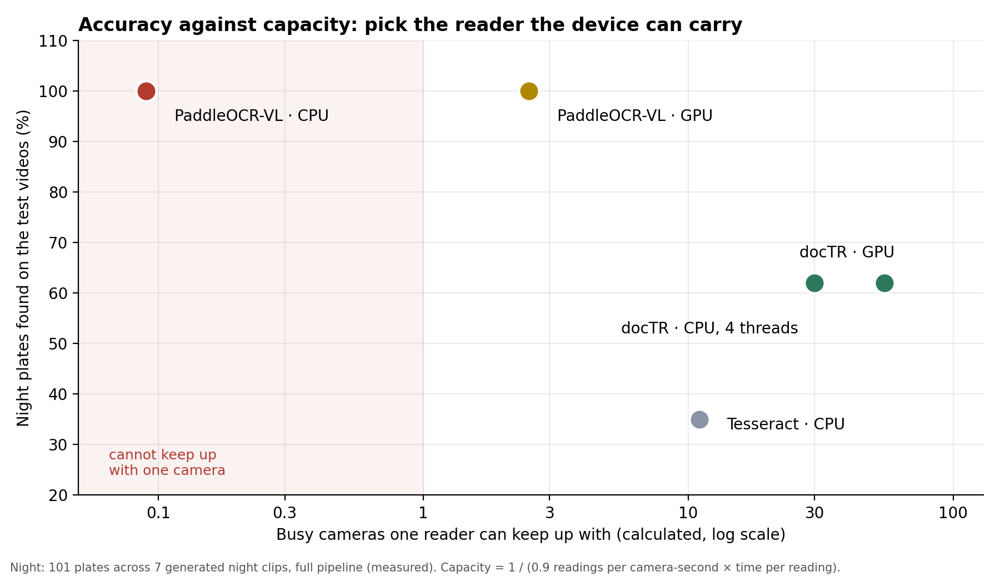

# Plate readers: accuracy against device capacity

*Gujarat CCTV Integration Platform · measured 14 September 2026*

Which plate reader should a site run? The most accurate reader cannot keep up
with many cameras, and the fastest one misses more plates. This page puts both
on one scale, so the choice follows from the hardware a site actually has.

Every number is labelled **measured** (run on this platform) or **calculated**
(arithmetic on measured numbers). Hardware: one 20-core CPU, one NVIDIA RTX
A5000 (24 GB), two Quadro RTX 5000 (16 GB).

---

## 1. How good is each reader? *(measured)*

### Real plates from the government cameras

42 plates checked by hand, one crop each, no tuning on these plates.

| Reader | Exactly right | Off by ≤ 1 | Off by ≤ 2 | Invented a plate on 25 unreadable crops |
|---|---|---|---|---|
| Tesseract (classic OCR) | 5 | 13 | 20 | 2 |
| **docTR** (PARSeq) | 24 | 30 | 31 | **1** |
| **PaddleOCR-VL** | 27 | **41** | **41** | 3 |
| Qwen3-VL-4B | 31 | 40 | 42 | **19**. Makes plates up, so not used |

### Full pipeline on the test videos

Tracking, voting and normalisation included. Plates found exactly.

| Reader | Night (101 plates) | Day (69 plates) |
|---|---|---|
| Tesseract | 35 (35%) | 58 (84%) |
| **docTR** | 63 (62%) | 66 (96%) |
| **PaddleOCR-VL** | **101 (100%)** | **69 (100%)** |

### Live demo, 10 minutes each

| Setup | Vehicles | With a plate | Exactly right | Readings dropped |
|---|---|---|---|---|
| docTR, 9 cameras | 268 | 268 | 100% | 0% |
| **PaddleOCR-VL, 4 cameras** | 97 | 97 | **100%** | **0%** |
| PaddleOCR-VL, 9 cameras | — | — | — | GPU at 100%: past capacity |

The demo videos are daylight, so both readers are exact there. The difference
shows at night and on real footage (tables above).

---

## 2. How many cameras can each reader carry?

**Time per plate reading** *(measured)* and **busy cameras one reader keeps up
with** *(calculated)*. A busy test camera needs about **0.9 plate readings per
second** (measured across the 12 test videos, the same for every reader).
Capacity = 1 ÷ (0.9 × time per reading).

| Reader | Device | Time per reading | Busy cameras per reader |
|---|---|---|---|
| Tesseract | CPU | ~0.1 s | ~11 |
| **docTR** | CPU, 4 threads | 0.037 s | **~30** |
| **docTR** | GPU | 0.020 s | ~55 |
| **PaddleOCR-VL** | GPU (RTX A5000) | 0.44 s | **~2.5** |
| PaddleOCR-VL | CPU, 20 cores | 12.5 s | ~0.09: cannot keep up with one camera |

**Measured on one RTX A5000:** four PaddleOCR-VL readers (about 9 GB of GPU
memory) handled 4 cameras with nothing dropped, and were at 100% GPU with 9.

### At statewide scale *(calculated)*

| Choice for all 80,000 cameras | What it would take |
|---|---|
| docTR on the CPU at the edge | Fits the edge boxes already sized in the HLD (~50–57 cameras per 20-core box for the whole pipeline) |
| PaddleOCR-VL on every camera | Roughly 80,000 ÷ 10 ≈ **8,000 A5000-class GPUs**. Not realistic |
| docTR everywhere + PaddleOCR-VL on demand | One GPU per region covers the **12 cameras** a boost may hold at once |

---

## 3. So which reader, where?

| Situation | Use | Why |
|---|---|---|
| **Default, everywhere** | **docTR on the CPU** | Nearly doubles night plates found against classic OCR, runs on an ordinary edge box, and invents the fewest plates |
| **A vehicle has been narrowed to an area** | **OCR boost**: PaddleOCR-VL on the cameras around the last sighting, for 30 min – 12 h | The best reader, spent where it matters. One GPU can serve a boost of up to 12 cameras |
| **A site with GPU capacity to spare** | **PaddleOCR-VL always on** (`ANPR_OCR_BACKEND=paddleocr-vl`) | Allow about **2–3 busy cameras per reader** on an A5000-class GPU. Our recorded demo runs this way on 4 cameras |
| **No GPU at all** | docTR, never PaddleOCR-VL | PaddleOCR-VL takes 12.5 s per plate on a CPU. The platform refuses to run it there and says so |

### How the OCR boost works

1. An operator traces a plate and sees where the vehicle was last seen.
2. In the trace panel they press **Boost cameras near last sighting**, choosing
   2, 5 or 10 km and 30 min, 1 h or 3 h. (A single camera can be boosted from
   its own panel, or any set through `POST /api/ocr-boosts`.)
3. Within about 5 seconds each worker switches those cameras to PaddleOCR-VL
   and reports *running*, or *could not start* with the reason (for example,
   no GPU on that worker).
4. When the boost ends or is stopped, the cameras go back to docTR.

It is capped (12 cameras at once), audited, and always expires, so the GPU
budget cannot be spent by accident. Measured on the busiest demo camera, 5
minutes boosted against 5 minutes before: 42 vs 43 vehicles, all read exactly,
nothing dropped, other cameras unaffected.

---

## 4. Limits of these numbers

- The 42 real plates are 41 day and 1 night, mostly from two cameras.
- The test videos are generated, so they are easier than real footage. The order
  of the readers is the same on real plates.
- On the live government feed on 14 September, **no reader found real plates**.
  With the learned detectors (YOLO vehicles + a trained plate detector) the boxes
  land on real vehicles and real plates — 344 vehicles in 10 minutes — and the
  plates are a **median 29 pixels wide** and blurred by compression. The feed
  limits it, not the reader.
- "Busy cameras per reader" assumes traffic like the test videos. A quiet road
  needs fewer readings; a toll plaza needs more.
